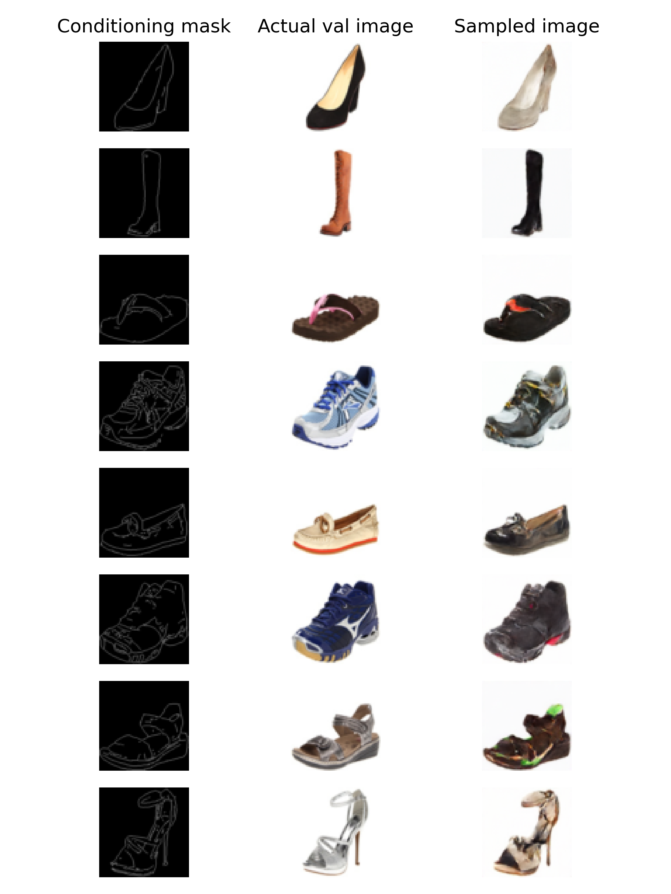

# Pix2Pix

[]()
[](https://github.com/psf/black)
[](http://mypy-lang.org)
[](https://pycqa.github.io/isort)
[](https://mkdocstrings.github.io)
[](https://github.com/pre-commit/pre-commit)
[](https://mlflow.org)
[](https://dvc.org)
[](https://hydra.cc)
[](https://github.com/PyCQA/bandit)
[](https://github.com/pytest-dev/pytest)
[](https://github.com/commitizen-tools/commitizen)

By training a DDPM model and fine-tuning it with a ControlNet, we can create an image translation model that transform an edge representation of a shoe into a realistic image.

## Prerequisites

You will need:

- `python` (see `pyproject.toml` for full version)
- `Git`
- `Make`
- a `.secrets` file with the required secrets and credentials
- load environment variables from `.env`

## Installation

Clone this repository (requires git ssh keys)

    git clone --recursive git@github.com:caetas/pix2pix.git
    cd pix2pix

Install dependencies

    conda create -y -n python3.9 python=3.9
    conda activate python3.9

or if environment already exists

    conda env create -f environment.yml
    conda activate python3.9

And then setup all virtualenv using make file recipe

    (pix2pix) $ make setup-all

## Dataset

We are currently using the **Edges2Shoes** subset of the Pix2Pix dataset that is available in [Kaggle](https://www.kaggle.com/datasets/vikramtiwari/pix2pix-dataset?select=edges2shoes) to generate items for training and validation. The **train** and **test** folders should be moved to the **data/raw** directory.

## Run the Code

In order to run the code, you will need to move to the correct directory first:

```bash
cd src/pix2pix
```

Then, you will need to train a DDPM model:

```bash
python ddpm_train.py
```

Afterwards, you can train a ControlNet that is able to apply masks to generate more realistic images of shoes based on the provided drawings:

```bash
python cnet_train.py
```
## Results

On the right we can see the images that were generated by the ControlNet that we trained based on the masks on the left column.



## Sources

This code is based on the tutorials provided in the repository [GenerativeModels](https://github.com/Project-MONAI/GenerativeModels/tree/main).

## Documentation

Full documentation is available here: [`docs/`](docs).

## Dev

See the [Developer](docs/DEVELOPER.md) guidelines for more information.

## Contributing

Contributions of any kind are welcome. Please read [CONTRIBUTING.md](docs/CONTRIBUTING.md]) for details and
the process for submitting pull requests to us.

## Changelog

See the [Changelog](CHANGELOG.md) for more information.

## Security

Thank you for improving the security of the project, please see the [Security Policy](docs/SECURITY.md)
for more information.

## License

This project is licensed under the terms of the `No license` license.
See [LICENSE](LICENSE) for more details.

## Citation

If you publish work that uses Pix2Pix, please cite Pix2Pix as follows:

```bibtex
@misc{Pix2Pix pix2pix,
  author = {None},
  title = {A short description of the project. No quotes.},
  year = {2023},
}
```
